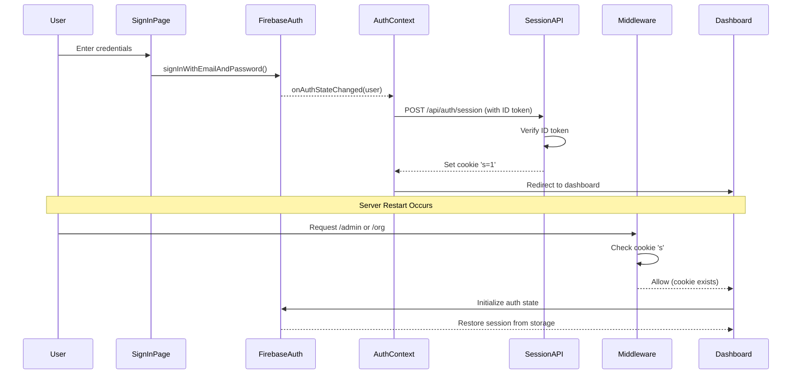

# Design Document: Authentication Persistence Fix

## Overview

This design addresses the authentication persistence issue by implementing a session cookie mechanism that bridges Firebase Auth (client-side) with Next.js middleware (server-side). The solution ensures that authenticated users remain signed in across server restarts and page refreshes.

### Current Problem

1. Firebase Auth stores authentication state in browser storage (localStorage/indexedDB)
2. Middleware checks for a session cookie `'s'` that is never set
3. After server restart, middleware blocks access before client-side Firebase can initialize
4. Users must sign out and sign in again to access protected routes

### Solution Approach

Implement a dual-layer authentication system:
- **Client-side**: Firebase Auth manages authentication state
- **Server-side**: Session cookie syncs with Firebase Auth state for middleware checks
- **Sync mechanism**: API route sets/removes cookie when auth state changes

## Architecture

### Component Interaction Flow



## Components and Interfaces

### 1. Session Management API Route

**File**: `src/app/api/auth/session/route.ts`

**Purpose**: Set or remove the session cookie based on Firebase Auth state

**Endpoints**:

```typescript
// POST /api/auth/session - Set session cookie
interface SetSessionRequest {
  idToken: string  // Firebase ID token
}

interface SetSessionResponse {
  success: boolean
  error?: string
}

// DELETE /api/auth/session - Remove session cookie
interface DeleteSessionResponse {
  success: boolean
}
```

**Implementation Details**:
- Verify Firebase ID token using Admin SDK
- Set HTTP-only cookie with 7-day expiration
- Use secure flag in production
- Use SameSite=Lax for CSRF protection

### 2. AuthContext Enhancement

**File**: `src/contexts/AuthContext.tsx`

**Changes**:
- Call session API when user signs in
- Call session API when user signs out
- Handle session sync in `onAuthStateChanged` listener

**New Function**:
```typescript
const syncSessionCookie = async (user: User | null) => {
  if (user) {
    const idToken = await user.getIdToken()
    await fetch('/api/auth/session', {
      method: 'POST',
      headers: { 'Content-Type': 'application/json' },
      body: JSON.stringify({ idToken })
    })
  } else {
    await fetch('/api/auth/session', { method: 'DELETE' })
  }
}
```

### 3. StudentAuthContext Enhancement

**File**: `src/contexts/StudentAuthContext.tsx`

**Changes**:
- Same session sync mechanism as AuthContext
- Call session API on student sign-in
- Call session API on student sign-out

### 4. Middleware Update

**File**: `middleware.ts`

**Changes**:
- Keep existing cookie check logic
- Cookie `'s'` with value `'1'` indicates authenticated
- Cookie `'s'` with value `'0'` or missing indicates unauthenticated
- No changes needed to routing logic

### 5. Sign-In Page Enhancement

**File**: `src/app/signin/page.tsx`

**Changes**:
- Session cookie will be set automatically by AuthContext
- No direct changes needed
- Cookie sync happens in auth state listener

## Data Models

### Session Cookie Structure

```typescript
interface SessionCookie {
  name: 's'
  value: '1' | '0'  // '1' = authenticated, '0' = not authenticated
  httpOnly: true
  secure: boolean  // true in production
  sameSite: 'lax'
  maxAge: number  // 7 days in seconds
  path: '/'
}
```

### Firebase ID Token Claims

```typescript
interface FirebaseTokenClaims {
  uid: string
  email: string
  email_verified: boolean
  iat: number  // issued at
  exp: number  // expiration
  // ... other standard claims
}
```

## Error Handling

### Session API Errors

1. **Invalid ID Token**
   - Return 401 Unauthorized
   - Client should sign out and redirect to sign-in

2. **Token Verification Failure**
   - Log error details
   - Return 500 Internal Server Error
   - Client should retry once, then sign out

3. **Missing Firebase Admin**
   - Return 503 Service Unavailable
   - Show user-friendly error message

### Auth Context Errors

1. **Session Sync Failure**
   - Log warning (non-blocking)
   - User can still access app via client-side auth
   - Retry on next auth state change

2. **Network Errors**
   - Retry with exponential backoff
   - Max 3 retries
   - Continue with client-side auth if all retries fail

### Middleware Errors

1. **Cookie Parse Errors**
   - Treat as unauthenticated
   - Redirect to sign-in

2. **Malformed Cookie**
   - Clear cookie
   - Redirect to sign-in

## Testing Strategy

### Unit Tests

1. **Session API Route**
   - Test valid ID token → cookie set correctly
   - Test invalid ID token → 401 error
   - Test DELETE → cookie removed
   - Test cookie attributes (httpOnly, secure, sameSite)

2. **Auth Context**
   - Test session sync on sign-in
   - Test session sync on sign-out
   - Test session sync on auth state change
   - Test error handling and retries

### Integration Tests

1. **End-to-End Auth Flow**
   - Sign in → verify cookie set
   - Refresh page → verify still authenticated
   - Sign out → verify cookie removed
   - Access protected route without cookie → verify redirect

2. **Server Restart Simulation**
   - Sign in
   - Simulate server restart (clear server state)
   - Verify middleware allows access with valid cookie
   - Verify client-side auth restores from Firebase

### Manual Testing

1. **Cross-Browser Testing**
   - Test in Chrome, Firefox, Safari, Edge
   - Verify cookie persistence
   - Verify auth state sync

2. **Network Conditions**
   - Test with slow network
   - Test with intermittent connectivity
   - Verify graceful degradation

## Security Considerations

### Cookie Security

1. **HTTP-Only Flag**: Prevents XSS attacks from accessing the cookie
2. **Secure Flag**: Ensures cookie only sent over HTTPS in production
3. **SameSite=Lax**: Protects against CSRF attacks while allowing normal navigation
4. **Short-lived Tokens**: Firebase ID tokens expire after 1 hour, requiring refresh

### Token Verification

1. **Server-Side Verification**: Always verify ID tokens on the server using Firebase Admin SDK
2. **No Client-Side Trust**: Never trust client-provided auth state without verification
3. **Token Expiration**: Respect Firebase token expiration times

### Session Management

1. **Explicit Sign-Out**: Always clear cookie on sign-out
2. **Session Timeout**: Cookie expires after 7 days, requiring re-authentication
3. **Concurrent Sessions**: Multiple devices can have valid sessions simultaneously

## Performance Considerations

### Cookie Size

- Session cookie is minimal (name: 's', value: '1')
- Total size: ~20 bytes
- Negligible impact on request size

### API Calls

- Session sync happens once per auth state change
- Not called on every page navigation
- Minimal performance impact

### Middleware Performance

- Cookie check is fast (simple string comparison)
- No database queries in middleware
- No external API calls in middleware

## Migration Strategy

### Deployment Steps

1. Deploy session API route
2. Deploy updated auth contexts
3. Deploy middleware (no changes needed)
4. Monitor for errors

### Rollback Plan

If issues occur:
1. Revert auth context changes
2. Keep session API route (harmless if not called)
3. Users will need to sign in again (acceptable for rollback)

### User Impact

- **Existing signed-in users**: Will be signed out once, need to sign in again
- **After fix**: Seamless experience across server restarts
- **No data loss**: All user data and profiles remain intact
