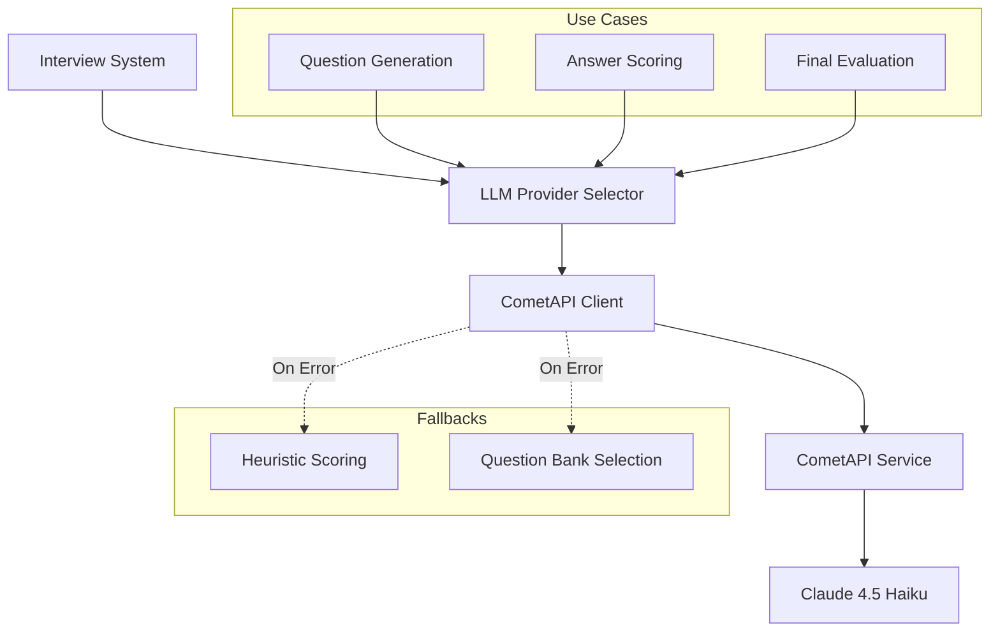

# Design Document: CometAPI LLM Migration

## Overview

This design document describes the migration of the interview system's LLM infrastructure from a multi-provider setup (MegaLLM/Groq) to a single provider: CometAPI with Claude 4.5 Haiku. The migration simplifies the codebase by removing provider-switching logic while maintaining all existing functionality.

## Architecture



## Components and Interfaces

### 1. LLM Provider Selector (`src/lib/llm-provider-selector.ts`)

The provider selector will be simplified to support only CometAPI:

```typescript
export type LLMUseCase = 'question_selection' | 'answer_scoring' | 'final_evaluation';

export interface LLMProviderConfig {
  provider: 'cometapi';
  model: string;
  apiKey: string;
  baseUrl: string;
}

interface LLMResponse {
  content: string;
  usage?: {
    prompt_tokens: number;
    completion_tokens: number;
    total_tokens: number;
  };
}
```

### 2. CometAPI Configuration

| Parameter | Value |
|-----------|-------|
| Base URL | `https://api.cometapi.com/v1` |
| Model | `claude-4-5-haiku` (or CometAPI's identifier) |
| API Key Env | `COMETAPI_API_KEY` |
| Default Timeout | 30s (question/scoring), 60s (final evaluation) |
| Max Tokens | 8192 |

### 3. API Call Flow


## Data Models

### LLMProviderConfig
```typescript
interface LLMProviderConfig {
  provider: 'cometapi';
  model: string;        // e.g., 'claude-4-5-haiku'
  apiKey: string;       // From COMETAPI_API_KEY
  baseUrl: string;      // 'https://api.cometapi.com/v1'
}
```

### Environment Variables
```
COMETAPI_API_KEY=your-api-key-here
COMETAPI_MODEL=claude-4-5-haiku  # Optional override
```

## Correctness Properties

*A property is a characteristic or behavior that should hold true across all valid executions of a system-essentially, a formal statement about what the system should do. Properties serve as the bridge between human-readable specifications and machine-verifiable correctness guarantees.*

### Property 1: Provider Configuration Consistency
*For any* interview route and use case combination, when `COMETAPI_API_KEY` is set, the provider selector SHALL return a config with `provider: 'cometapi'` and `baseUrl: 'https://api.cometapi.com/v1'`
**Validates: Requirements 1.1, 2.4**

### Property 2: Model Selection Consistency
*For any* use case (question_selection, answer_scoring, final_evaluation), the selected model SHALL be Claude 4.5 Haiku (or the value of `COMETAPI_MODEL` if set)
**Validates: Requirements 1.3**

### Property 3: JSON Response Parsing Robustness
*For any* valid JSON embedded in markdown code blocks, HTML tags, or explanatory text, the parser SHALL extract and return the JSON object correctly
**Validates: Requirements 3.4**

### Property 4: Rubric Score Validation
*For any* scoring response from CometAPI, all rubric scores SHALL be clamped to the range [0, 100]
**Validates: Requirements 3.2**

### Property 5: Decision Validation
*For any* final evaluation response, the decision SHALL be one of: 'accepted', 'rejected', or 'borderline'
**Validates: Requirements 3.3**

## Error Handling

| Error Type | Handling Strategy |
|------------|-------------------|
| Missing API Key | Return `null` from selector, use heuristic fallback |
| API Timeout | Log error, return heuristic scores |
| HTTP Error (4xx/5xx) | Log error details, return heuristic scores |
| JSON Parse Error | Attempt JSON extraction, fallback to neutral scores |
| Invalid Response | Clamp values, use defaults for missing fields |

## Testing Strategy

### Unit Tests
- Test `selectLLMProvider` returns correct config when API key is set
- Test `selectLLMProvider` returns null when API key is missing
- Test JSON parsing with various malformed inputs
- Test timeout configuration for different use cases

### Property-Based Tests
Using a property-based testing library (e.g., fast-check):

1. **Provider Config Property**: For all route/useCase combinations, verify consistent CometAPI config
2. **JSON Extraction Property**: For all valid JSON wrapped in various formats, verify correct extraction
3. **Score Clamping Property**: For all numeric inputs, verify scores are clamped to [0, 100]
4. **Decision Normalization Property**: For all decision strings, verify normalization to valid values

### Integration Tests
- Test actual CometAPI calls with mock server
- Test end-to-end question generation flow
- Test end-to-end scoring flow
- Test end-to-end final evaluation flow
