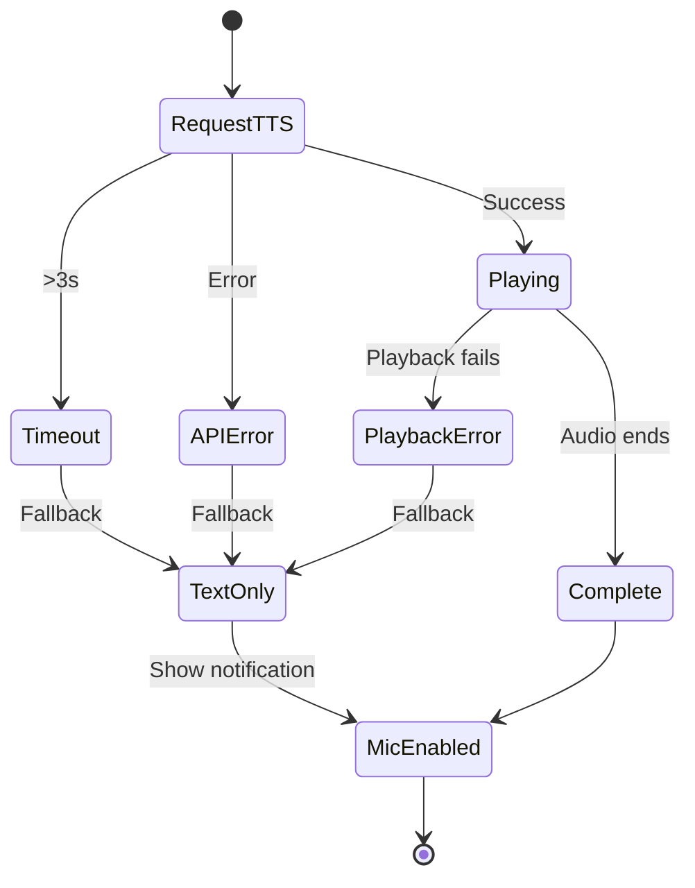

# Design Document: USA Interview TTS Integration

## Overview

This design integrates MiniMax Text-to-Speech (TTS) into the USA F1 visa interview simulation. The system will convert interview questions to spoken audio using MiniMax's speech-02-hd model via their synchronous WebSocket API, providing a realistic visa officer experience. Voice selection is managed through the admin dashboard, and the system includes robust fallback handling for network issues.

## Architecture

```mermaid
flowchart TB
    subgraph Client["Browser Client"]
        IR[InterviewRunner]
        TH[useTTS Hook]
        AP[Audio Player]
    end
    
    subgraph Server["Next.js API"]
        TA[/api/tts/synthesize]
        TC[/api/admin/tts-config]
        FS[(Firestore)]
    end
    
    subgraph External["MiniMax API"]
        MM[speech-02-hd WebSocket]
    end
    
    IR --> TH
    TH --> TA
    TA --> MM
    MM --> TA
    TA --> TH
    TH --> AP
    AP --> IR
    
    TC --> FS
    TA --> FS
```

## Components and Interfaces

### 1. MiniMax TTS Service (`src/lib/minimax-tts-service.ts`)

Server-side service that handles communication with MiniMax API.

```typescript
interface TTSConfig {
  apiKey: string;
  model: 'speech-02-hd' | 'speech-02-turbo' | 'speech-2.6-hd' | 'speech-2.6-turbo';
  voiceId: string;
  speechRate?: number; // 0.5 - 2.0, default 1.0
  volume?: number; // 0.0 - 1.0, default 1.0
}

interface TTSRequest {
  text: string;
  voiceId?: string; // Override default voice
}

interface TTSResponse {
  audioData: ArrayBuffer;
  duration: number; // milliseconds
  characterCount: number;
}

class MinimaxTTSService {
  constructor(config: TTSConfig);
  
  async synthesize(request: TTSRequest): Promise<TTSResponse>;
  async getAvailableVoices(): Promise<Voice[]>;
}
```

### 2. TTS API Route (`src/app/api/tts/synthesize/route.ts`)

Server-side API endpoint that proxies TTS requests to MiniMax.

```typescript
// POST /api/tts/synthesize
interface SynthesizeRequest {
  text: string;
  voiceId?: string;
}

interface SynthesizeResponse {
  audioUrl: string; // Base64 data URL or blob URL
  duration: number;
  characterCount: number;
}
```

### 3. TTS React Hook (`src/hooks/useTTS.ts`)

Client-side hook for managing TTS playback state.

```typescript
interface UseTTSOptions {
  onStart?: () => void;
  onEnd?: () => void;
  onError?: (error: Error) => void;
}

interface UseTTSReturn {
  speak: (text: string) => Promise<void>;
  stop: () => void;
  isPlaying: boolean;
  isLoading: boolean;
  error: Error | null;
}

function useTTS(options?: UseTTSOptions): UseTTSReturn;
```

### 4. Admin TTS Settings Component (`src/components/admin/TTSSettings.tsx`)

Admin interface for configuring TTS voice selection.

```typescript
interface TTSSettingsProps {
  onSave: (config: TTSAdminConfig) => void;
}

interface TTSAdminConfig {
  enabled: boolean;
  voiceId: string;
  speechRate: number;
  volume: number;
}
```

### 5. TTS Config API Route (`src/app/api/admin/tts-config/route.ts`)

API for managing TTS configuration in Firestore.

```typescript
// GET /api/admin/tts-config - Get current config
// PUT /api/admin/tts-config - Update config
interface TTSConfigDocument {
  enabled: boolean;
  voiceId: string;
  speechRate: number;
  volume: number;
  updatedAt: Timestamp;
  updatedBy: string;
}
```

## Data Models

### Firestore Schema

```typescript
// Collection: platform_settings
// Document: tts_config
interface TTSConfigDocument {
  enabled: boolean;
  voiceId: string;
  speechRate: number;
  volume: number;
  updatedAt: Timestamp;
  updatedBy: string;
}

// Collection: tts_usage_logs
interface TTSUsageLog {
  timestamp: Timestamp;
  userId: string;
  interviewId: string;
  characterCount: number;
  voiceId: string;
  success: boolean;
  latencyMs: number;
  errorMessage?: string;
}
```

### MiniMax Voice Model

```typescript
interface Voice {
  voiceId: string;
  name: string;
  gender: 'male' | 'female';
  language: string;
  accent?: string;
  description?: string;
}

// Default voices for USA interview
const DEFAULT_VOICES = {
  male: 'American_Male_Professional',
  female: 'American_Female_Professional',
};
```

## Correctness Properties

*A property is a characteristic or behavior that should hold true across all valid executions of a system-essentially, a formal statement about what the system should do. Properties serve as the bridge between human-readable specifications and machine-verifiable correctness guarantees.*

### Property 1: TTS triggers on question display
*For any* interview question text, when the question is displayed and TTS is enabled, the TTS service SHALL be invoked with that question text.
**Validates: Requirements 1.1**

### Property 2: Speaking indicator reflects playback state
*For any* TTS playback session, the speaking indicator state SHALL be true if and only if audio is currently playing.
**Validates: Requirements 1.2**

### Property 3: Microphone enables after audio completion
*For any* TTS playback that completes successfully, the microphone enabled state SHALL transition to true within 100ms of audio completion.
**Validates: Requirements 1.3**

### Property 4: Graceful fallback on TTS failure
*For any* TTS API error, the interview SHALL continue with the question text visible and no audio, without throwing an unhandled exception.
**Validates: Requirements 1.4, 7.1**

### Property 5: Timeout triggers fallback
*For any* TTS request that exceeds 3 seconds, the system SHALL display a loading indicator and then fall back to text-only mode.
**Validates: Requirements 3.3**

### Property 6: Microphone disabled during playback
*For any* TTS playback session, the microphone SHALL remain disabled while isPlaying is true.
**Validates: Requirements 4.1, 4.2**

### Property 7: Voice configuration persistence
*For any* voice selection made by an admin, the voiceId SHALL be retrievable from the configuration after a page refresh.
**Validates: Requirements 5.2**

### Property 8: Configured voice used in requests
*For any* TTS synthesis request when a voice is configured, the request SHALL include the configured voiceId.
**Validates: Requirements 5.3**

### Property 9: Default voice fallback
*For any* TTS synthesis request when no voice is configured, the request SHALL use the default American English voice.
**Validates: Requirements 5.4**

### Property 10: TTS disabled skips synthesis
*For any* interview question when TTS is disabled in configuration, no TTS API calls SHALL be made.
**Validates: Requirements 6.3**

### Property 11: Fallback notification shown
*For any* transition to fallback mode due to TTS failure, a user notification SHALL be displayed indicating audio is unavailable.
**Validates: Requirements 7.3**

## Error Handling

### TTS API Errors

| Error Type | Handling Strategy |
|------------|-------------------|
| Network timeout (>3s) | Show loading indicator, then fallback to text-only |
| API authentication error | Log error, fallback to text-only, alert admin |
| Invalid voice ID | Use default voice, log warning |
| Rate limiting | Retry with exponential backoff (max 2 retries) |
| Audio playback failure | Display question text, notify user |

### Error Recovery Flow



## Testing Strategy

### Unit Testing

Unit tests will verify individual component behavior:

- `minimax-tts-service.ts`: Mock MiniMax API responses, test error handling
- `useTTS.ts`: Test state transitions, playback lifecycle
- `TTSSettings.tsx`: Test voice selection UI, form validation

### Property-Based Testing

Property-based tests will use **fast-check** library to verify correctness properties:

1. **TTS State Machine Properties**: Generate random sequences of TTS events and verify state consistency
2. **Configuration Properties**: Generate random voice configurations and verify persistence
3. **Error Handling Properties**: Generate random error scenarios and verify graceful degradation

Each property-based test will:
- Run a minimum of 100 iterations
- Be tagged with the corresponding correctness property reference
- Use format: `**Feature: usa-interview-tts, Property {number}: {property_text}**`

### Integration Testing

- End-to-end flow: Question display → TTS request → Audio playback → Microphone enable
- Admin configuration flow: Voice selection → Save → Verify in interview
- Fallback scenarios: Network failure, API errors, playback failures
